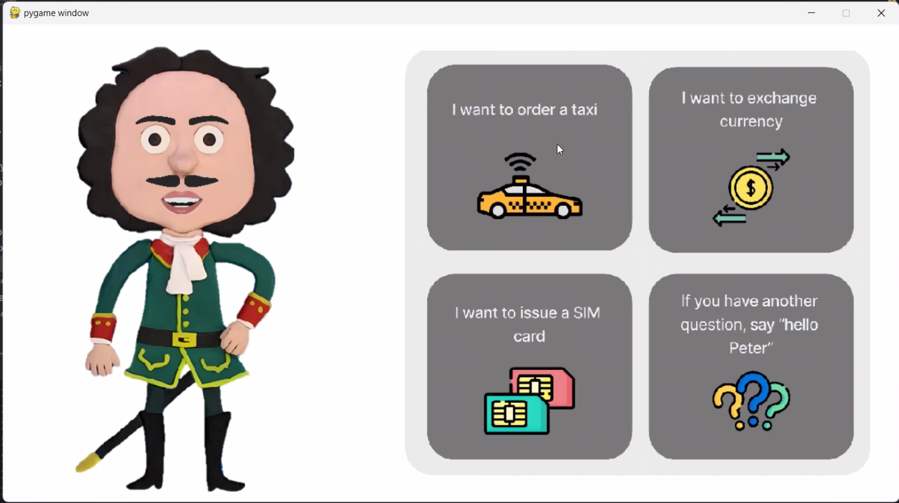
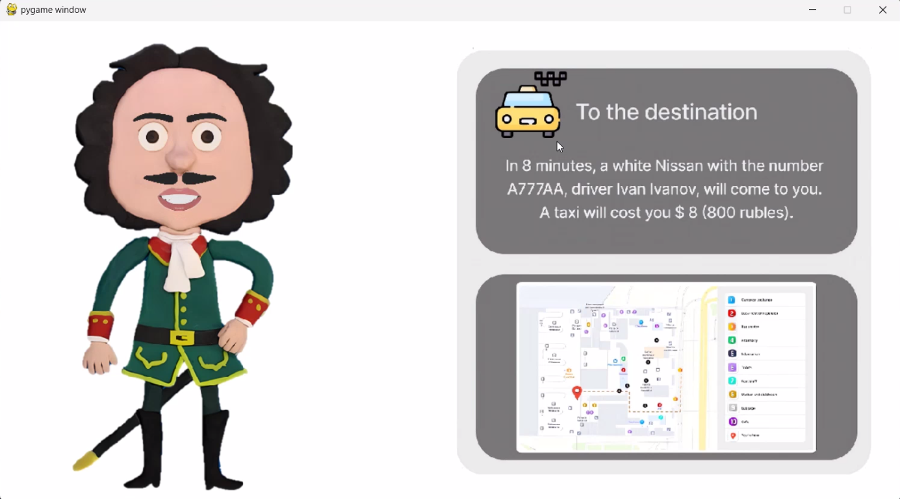

# hi_peter SpecTra1te Voice Assistant Project

Welcome to SpecTra1te! We're excited to introduce our project: a voice assistant named Peter. Peter can help you summon a taxi, provide currency exchange rates, assist in getting a local SIM card, and answer any questions you may have.

## Getting Started

To get started with our project, follow these steps:

1. **Clone our repository** to your local workspace using SSH:
    ```
    git clone git@github.com:NAKAZUKA/hi_peter.git
    ```
   Or using HTTPS:
    ```
    git clone https://github.com/NAKAZUKA/hi_peter.git
    ```

2. **Set up a virtual environment** and activate it:

    **Windows:**
    ```
    python -m venv venv
    .\venv\Scripts\activate
    ```

    **Linux:**
    ```
    python3 -m venv venv
    source venv/bin/activate
    ```

3. **Install dependencies** from the `requirements.txt` file:
    ```
    pip install -r requirements.txt
    ```

   Ensure that you have Python version 3.9 or higher installed to work with this project.

## Running the Application

The executable code can be found in the `Vosk.py` file. After running it, you'll encounter our Peter and the application window.

## Screenshots

Here are some screenshots of our application:




